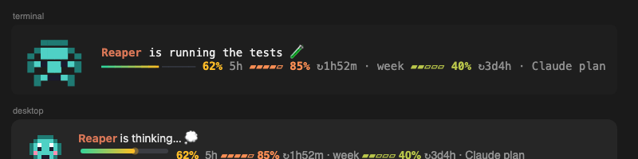
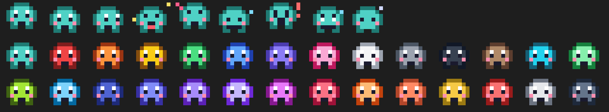

# pixel-pet

A tiny animated pixel pet that lives above your Claude Code prompt. It sleeps when things are quiet, narrates what Claude is doing, watches you type, hatches little helpers for subagents, and shows a live context meter beside it.





## What it does

- **Sleeps and wakes.** A new session finds it fast asleep: eyes closed, breathing slowly, z's drifting up and a snore bubble that swells and pops. Your first keystroke or message wakes it slowly (blinks, a yawn, a little stretch), then it carries on. After a quiet minute it nods off again through a few heavy-lidded, yawning seconds.
- **Narrates Claude's work**, one line per action as it starts: "is reading auth.ts…", "is editing app.ts ✏️", "is running the tests 🧪", "is committing the work ✍️", "is installing packages 📦", "is searching the web for …", "is waiting for your OK ✋", "is tidying its memory 🧹" and more. Each line stays up for at least a second. On desktop the new line slides up into place as the old one drifts away; in the terminal, where text moves only by whole rows, it fades through.
- **Hatches helpers for subagents.** Each subagent Claude starts gets a mini pet half its size, in the agent's own colour (the `color:` in its definition) or a stable random one. Helpers line up on the meter line, left of the context bar, newest first. A new one opens its slot, smoothly pushing the rest of the line right, then springs in. Several started together arrive one by one. It bobs while its agent works; when the agent is done it waves bye, floats up and fades, and its slot closes.
- **Watches you type.** Its eyes follow your caret across the line as if reading along ("is reading your code…" when it looks like code). A backspace makes it wince, deleting a big chunk makes it gasp with a "!", a huge paste gets a "whoa", and please or thanks makes it blush.
- **Click it to pet it.** A heart pops where you click and it blushes.
- **Context meter** on its second line: a gradient bar (mint → amber → red) that glides to each reading and shimmers while Claude works. After it come your Claude plan's 5-hour and weekly usage as small pills, with a window's reset time once it passes 70%. On the API or Bedrock/Vertex/Foundry it shows the dollars actually billed instead. Point at the meter (ⓘ) for the details: context tokens, when each window resets, and how you're billed.
- **28 colours.** `/pet color pink` changes it. As you type the name it tries each colour on, and the names show up as suggestions.
- **Smooth everywhere.** In the terminal the pet, its helpers, the line and the meter animate on the terminal's own frame clock. In the desktop app they're transparent SVGs with the motion built in, gliding between pixels. Moods and colours fade into each other instead of popping.

## Install

```
/plugin marketplace add lakmadev/pixel-pet
/plugin install pixel-pet@pixel-pet
```

## Commands

| Command | |
| --- | --- |
| `/pet` | Its name, colour, turns together, pets, and age |
| `/pet color <name>` | teal, red, orange, yellow, green, blue, purple, pink, white, gray, black, brown, cyan, mint, lime, sky, navy, indigo, violet, lavender, magenta, rose, peach, coral, gold, lava, ghost, midnight |
| `/pet rename <name>` | Rename it (default: Bit) |
| `/pet hide` / `/pet show` | Tuck it away or bring it back |

Settings (`/config`): `name`, `color`.

## What it reads

Hook events (tool calls, prompts, turns, subagent starts) and the usage figures Claude Code reports, plus a custom agent's definition file for its colour. It reads the `CLAUDE_CODE_USE_BEDROCK` / `_VERTEX` / `_FOUNDRY` switches to name who bills you, never an API key. Nothing leaves your machine; its name, colour and counts are kept in Claude Code's plugin store.

Part of [lakmadev/claude-mods](https://github.com/lakmadev/claude-mods), a pack of eleven Claude Code mods. MIT licensed.
